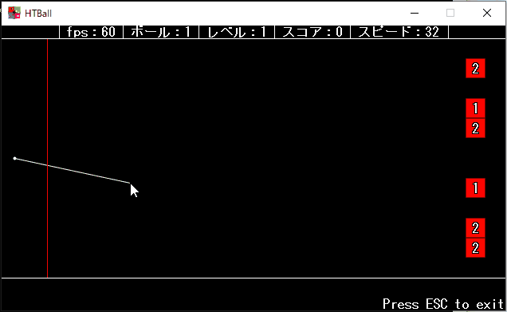
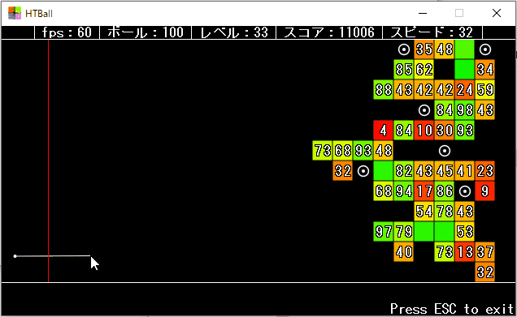

# HTBall

`HTBall` is a game. The player breaks blocks with colorful balls.

## Description

If I feel like it, I write it...

### Word definitions

## Demo

## Requirement

This application is executable on Windows.

## Usage

You can play by just clicking the `.exe` file.

## Install

Place anywhere you like.

## Contribution

1. Fork it ( https://github.com/HotariTobu/HTBall )
2. Create your feature branch (git checkout -b my-new-feature)
3. Commit your changes (git commit -am 'Add some feature')
4. Push to the branch (git push origin my-new-feature)
5. Create a new Pull Request

## License

[Unlicense](LICENSE)

## Author

[HotariTobu](https://github.com/HotariTobu)
